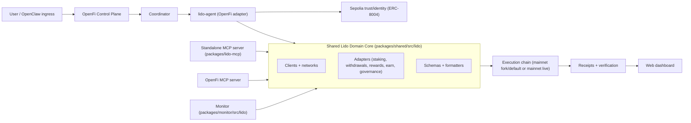
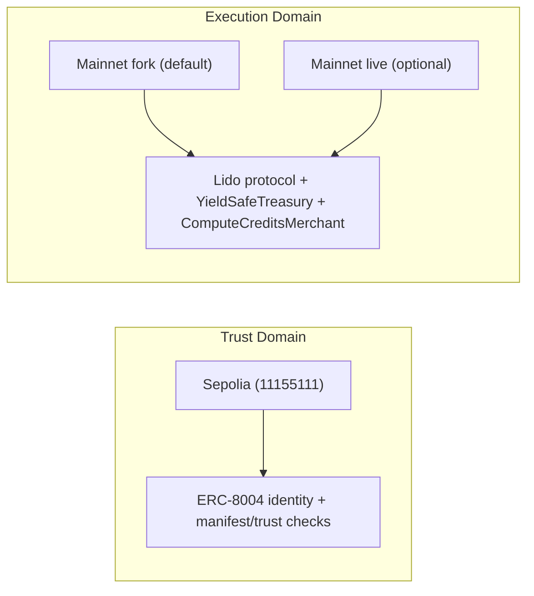

# Architecture

## Narrative

OpenFi Lido MCP Suite is a fork-first, mainnet-ready Lido system that lets humans fund AI agents with wstETH-backed yield while structurally protecting principal, monitors Lido Earn vault positions in plain language, and exposes staking, treasury, and governance actions through a reusable MCP server.

## System Diagram

## Trust vs Execution Split

## Lifecycle

OpenFi run lifecycle for Lido actions:

1. discover
2. plan
3. trust check (Sepolia)
4. policy check
5. dry run
6. execute
7. verify
8. summarize
9. record

## Invariants

- Agent cannot withdraw principal from `YieldSafeTreasury`
- Principal baseline tracked in stETH-equivalent units
- Spend path rechecks principal floor post-transfer
- Whitelist/per-tx/window/sub-agent budget checks enforced onchain
- Receipts always include chain/domain labels

## Threat Model

- Compromised agent key
- Malicious merchant recipient
- Stale APR/health data
- RPC/API downtime
- Owner misconfiguration (whitelist/caps/budgets)
- Rebase/accounting misunderstandings
- Trust/execution chain confusion

## Security Assumptions

- Owner key custody is secure
- Sepolia trust metadata is correctly registered
- Execution signer has expected permissions
- Lido addresses are sourced from official docs only
