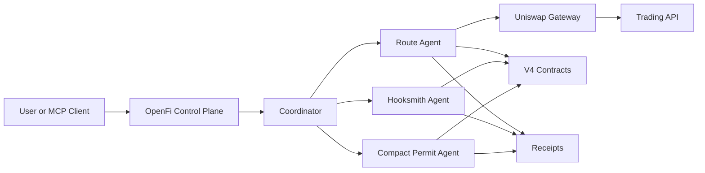

# Uniswap Architecture

OpenFi Uniswap suite has three specialist agents inside the existing runtime:

- `hooksmith-agent`
- `route-agent`
- `compact-permit-agent`

Shared core:

- `packages/shared/src/uniswap/*`
- `packages/uniswap-gateway/*`
- `packages/routing/*`
- `packages/liquidity/*`
- `packages/hooksmith/*`
- `packages/compact-permit/*`

Trust/execution split:

- Trust: Sepolia ERC-8004
- Execution: Unichain Sepolia (1301), Base Sepolia (84532), Sepolia (11155111)

Notes:
- UniswapX adapter is scaffolded as feature-flagged off (`UNISWAPX_ENABLED=false`) for testnet.
- LP writes run through direct PositionManager calls.
